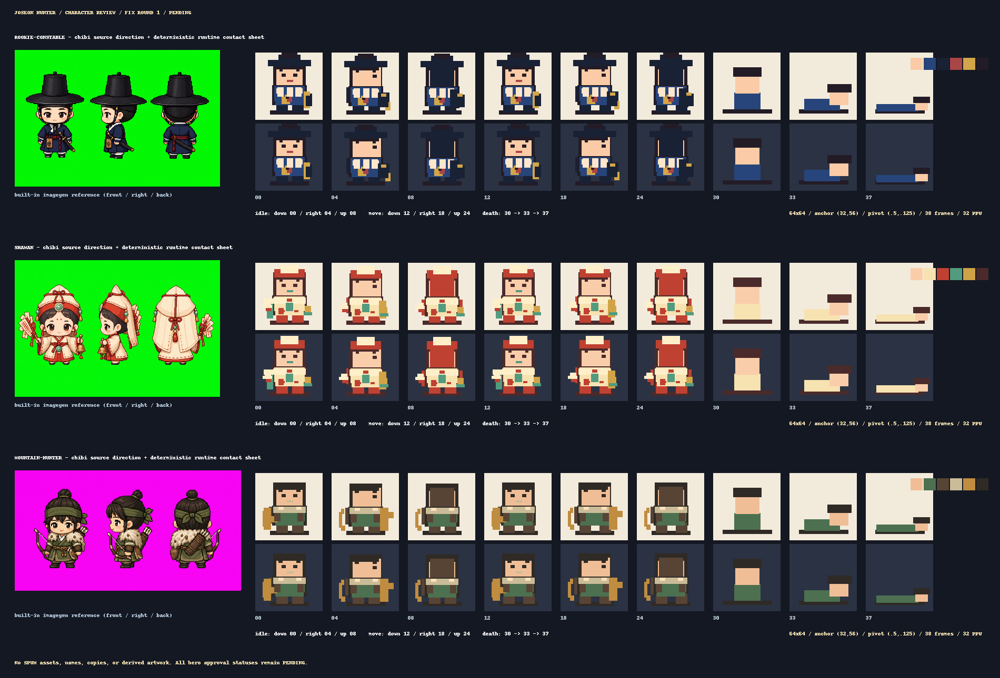

# Character review - fix round 1, pending approval

This replaces the earlier draft with an original super-deformed Joseon-fantasy direction: 2 to 2.5 heads tall, head about 40 to 45 percent of the character height, and compact limbs. Each left-hand source panel is a separately generated built-in-imagegen three-view reference; the matching runtime contact sheet is deterministic pixel art, not a generated sprite sheet.

| Hero | Readable identity | Direction samples | Motion/death samples |
| --- | --- | --- | --- |
| Rookie constable | Navy patrol uniform, oversized black gat, hopae, hwando | idle 00 / 04 / 08; move 12 / 18 / 24 | death 30 / 33 / 37 |
| Shaman | Cream/vermilion robe, jade ornament, talisman bundle, bell | idle 00 / 04 / 08; move 12 / 18 / 24 | death 30 / 33 / 37 |
| Mountain hunter | Muted green garb, fur shoulder, horn bow, quiver | idle 00 / 04 / 08; move 12 / 18 / 24 | death 30 / 33 / 37 |

Every sheet is 384x448, with 38 occupied 64x64 cells, foot anchor `(32,56)`, pivot `(0.5,0.125)`, and 32 PPU. Idle/move/death are the only ranges: no attack or hit frames exist. The board presents the exact down/right/up frames and light/dark background checks; move poses alternate body/feet, and death frames progress from fall to collapse.

Each hero includes deterministic source layers, palette, flattened sheet, individual 96x96 portrait, and individual locked silhouette. Rookie constable has four individually addressable palette variants. Every character/mannequin manifest entry remains `pending`; no user approval has been inferred.

No SPUM assets, names, copies, or derived artwork are present.

## Requested decision

Please explicitly approve this character batch or list exact revisions. Silence does not constitute approval.
